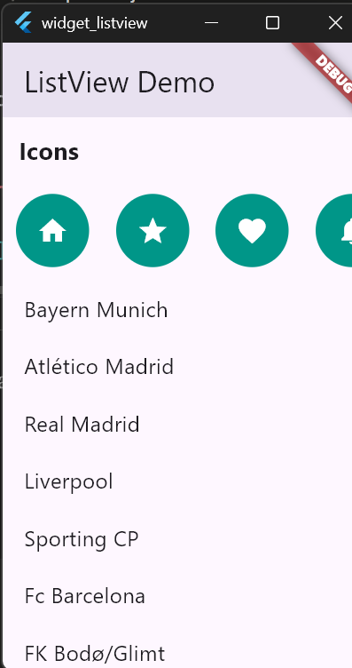

# Flutter ListView Widget Demo

This is a Flutter application that uses a ListView both with a horizontal and vertical axis using the 'ListView' widget


# How to Run

1. Clone the repository:
```bash
   git clone https://github.com/hniyongabo/Widget_ListView.git
```
2. Go to the project folder:
```bash
   cd widget_listview
```
3. Install dependencies:
```bash
   flutter pub get
```
4. Run the app:
```bash
   flutter run
```

## ListView Attributes

**Attribute Description**

**'scrollDirection'**

it controls the direction of the scroll whether the list will scroll horizontally or vertically.In the code it is set 'scrollDirection: Axis.horizontal'.
For the vertical axis there is no need to include it the list scrolls vertically by default

**'padding'**

Adds spacing around the entire list content 

**'children'**

The children attribute contains a list of widgets displayed inside the Listview -- used for both the icons and the teams list.

## Screenshots of the Listview UI




